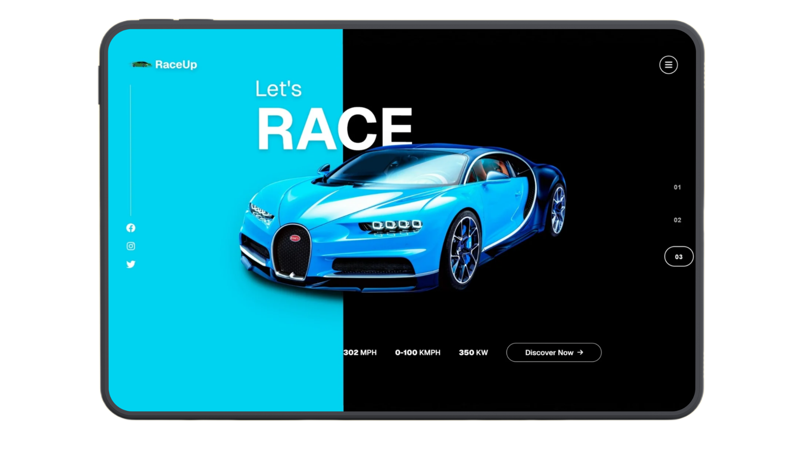

<div align="center" style="display: flex; align-items: center; justify-content: center;">
  

  <div style="margin-left: 6px;">
    <h1>WearoFit</h1>
    <p>A modern, smooth and high-performance car showcase experience designed with a premium UI and seamless slider animation.</p>
  </div>
</div>


---

##  Live Demo  
🔗 **RaceUp Website:** https://raceUp.sujandas.info/

---

##  Preview  


---

##  Overview

**RaceUp** is a minimal, performance-optimized car showroom interface built with **Next.js**.
It focuses on premium visuals, smooth motion, and fast navigation.

The platform includes a dynamic car slider, responsive design, theme support, animations, and **JSON-based** content handling.

---

## Key Features

* Modern and minimal automotive UI/UX
* Fully responsive across all devices
* Smooth slider animation using Swiper
* GSAP and Framer Motion transitions
* Light and dark theme support
* Dynamic pages for each car model
* JSON-based car data
* Optimized assets and fast performance
* Clean code structure

---

## Tech Stack

* Next.js 16
* React 19
* TypeScript
* Tailwind CSS 4
* Swiper.js
* GSAP
* Framer Motion
* Radix UI
* Lucide Icons

---

## Installation & Setup

```bash
# Clone the project
git clone https://github.com/devsujandas/raceup.git
cd raceup

# Install dependencies
npm install

# Start development server
npm run dev
```

Visit the app:

```
http://localhost:3000
```

---

## Project Structure

```
app/
├── cars/
│   └── [id]/
│       ├── page.tsx
│       └── layout.tsx
├── globals.css
├── layout.tsx
└── page.tsx

components/
├── ui/
└── theme-provider.tsx

public/
├── data/
│   └── cars.json
├── logo.png
├── placeholder-user.jpg
└── placeholder.svg

styles/
lib/
hooks/

next.config.mjs  
postcss.config.mjs  
package.json  
tsconfig.json  
```

---

## Deployment

RaceUp can be deployed on:

* Vercel (Recommended)
* Netlify
* Cloudflare Pages

Connect your repository and deploy instantly.

---

## License

RaceUp is protected under a commercial license.
Usage or redistribution requires permission.
Refer to the `LICENSE` file for more details.

---


##  Author

<div align="center">

[](https://github.com/devsujandas)
[](https://sujandas.info)
[](https://instagram.com/devsujandas)
[](https://linkedin.com/in/devsujandas)

</div>

<div align="center">
Thank you for exploring WearoFit! Feel free to star the repository or share feedback.
</div>
